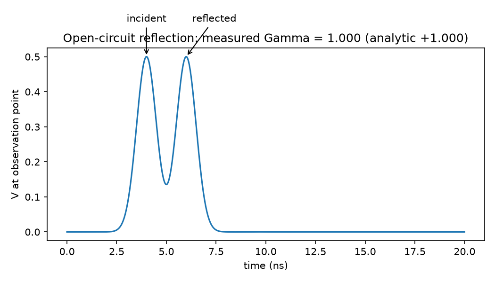
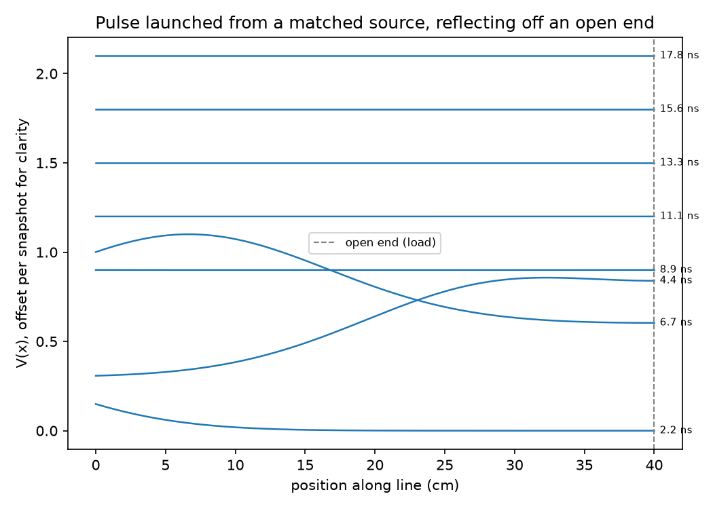

# Stage A: 1D Telegrapher's Equation FDTD

## Goal

A 1D transmission line with a source, a characteristic impedance Z0, and a
load ZL. Launch a pulse, watch it reflect off the load, and recover the
reflection coefficient from the simulated fields, compared against the
analytic Gamma = (ZL - Z0) / (ZL + Z0).

## Procedure

1. **Core** (`src/telegrapher_fdtd.cpp`): a Yee-staggered leapfrog solver
   for `dV/dx = -L dI/dt`, `dI/dx = -C dV/dt`. V lives on integer grid
   nodes, I on half-integer nodes between them. Each step updates interior
   V using the old I, then I using the new V (matching the standard
   staggered-leapfrog form).
2. **Source**: a matched (Thevenin) source at node 0: an ideal voltage
   source `Vs(t)` (a Gaussian pulse) in series with `Rs = Z0`. This both
   launches a clean outgoing pulse and *absorbs* anything that returns to
   it, instead of re-reflecting it back down the line.
3. **Load**: a resistive termination `ZL` at the far node, modeled as a
   lumped half-cell capacitor (`C*dx/2`) discharging through `ZL`. `ZL < 0`
   means open circuit, `ZL == 0` means short.
4. **Measurement** (`py/fdtd.py`): find the incident pulse's peak, then
   search for the reflected pulse's peak outside a window around the
   incident peak (a few pulse-widths wide). Because the source is matched,
   these really are "the pulse going out" and "the pulse coming back once,"
   not a mix of multiple bounces.
5. One command regenerates every figure and reflection-coefficient table:
   `python py/run_telegrapher.py`.

## Results

The incident and reflected pulses at the observation point, for an
open-circuit load. Both peaks are 0.500: measured Gamma = 1.000, matching
the analytic value for an open circuit exactly.

Spatial snapshots of V(x) at 8 evenly-spaced times (offset vertically for
clarity), showing the pulse launched from the source (left), traveling down
the line, and reflecting off the open end (right, dashed line).

Measured vs. analytic Gamma across five terminations (from
`py/run_telegrapher.py`'s printed table):

| Case | ZL (ohm) | Measured Gamma | Analytic Gamma | Error |
|---|---|---|---|---|
| matched | 50 | 0.0114 | 0.0000 | 0.0114 |
| open | (open) | 1.0000 | 1.0000 | 0.0000 |
| short | 0 | -1.0000 | -1.0000 | 0.0000 |
| ZL = 25 ohm | 25 | -0.3330 | -0.3333 | 0.0003 |
| ZL = 100 ohm | 100 | 0.3336 | 0.3333 | 0.0003 |

Four of five cases match to within 0.03%. The matched case has the largest
error (0.0114), which makes sense: it's the one case where the "true"
answer is exactly zero, so any residual grid/measurement noise shows up as
100% of the (tiny) signal rather than a small fraction of a large one.

## Implementation map

| Piece | Code |
|---|---|
| FDTD core | `src/telegrapher_fdtd.cpp` |
| Build + run + measure Gamma | `py/fdtd.py` |
| Figures + summary table | `py/run_telegrapher.py` |
| Tests | `tests/test_reflection.py` |

## What went wrong

Three real bugs, in the order I hit them, all before the first correct
result:

1. **A boundary condition with its own, tighter stability limit.** The
   resistive load's half-cell-capacitor ODE is only stable for
   `dt <= C*dx*ZL`, which for a 50 ohm load landed almost exactly on the
   interior Courant limit I was already using, and the simulation blew up
   to `inf`/`NaN` within a couple thousand steps. Fixed by computing both
   stability limits and taking whichever is smaller, with real margin
   (a 0.2x safety factor), not just satisfying each one at the edge.
2. **A source that scaled with the number of timesteps, not physical
   time.** After fixing the boundary, an *open circuit* case (no resistive
   math involved at all) still blew up, and cutting the timestep smaller
   made it blow up *faster*, not slower: `max_amplitude * dt` came out
   constant across four different Courant numbers, which is the exact
   signature of adding a fixed amount of "charge" every timestep
   regardless of how long that timestep is. The bug was `V[0] += src`
   (accumulating the raw pulse value every step) instead of treating the
   source as a physical quantity independent of the simulation's time
   resolution. The fix at the time was to *set* `V[0]` directly to the
   source waveform each step; the real fix (next item) replaced this
   entirely.
3. **An unmatched (zero-impedance) source, silently corrupting every
   reflection measurement.** With the "set V[0] directly" fix, energy no
   longer blew up, but measured Gamma was wrong for every load except
   open circuit (open measured exactly right; short measured +0.56 instead
   of -1.0; ZL=25 measured +0.98 instead of -0.33). All four wrong cases
   converged to nearly the same (wrong) value regardless of the actual
   load, which was the tell: an ideal voltage source has zero output
   impedance, so it perfectly re-reflects anything that returns to it,
   and that secondary reflection was contaminating the "reflected pulse"
   measurement at the observation point. Confirmed by checking total
   electromagnetic energy over time (it was conserved, ruling out a real
   instability) and then by printing every above-threshold pulse arrival
   at the observation point with its time and sign, which showed the
   correct SIGN for open vs. short but the same wrong MAGNITUDE for both,
   meaning the measurement was picking up something unrelated to the
   actual load. The fix was the matched (Thevenin) source described above,
   validated first in a quick Python prototype against all five cases
   before being ported into the C++ core.

## References

- Standard Yee/leapfrog FDTD for transmission lines (any introductory FDTD
  or microwave-engineering text covers the telegrapher's-equation form used
  here).
- Matched (Thevenin) source termination is standard practice in
  transmission-line FDTD specifically to avoid source-end re-reflection;
  see any SPICE or FDTD text's treatment of "soft" vs. "hard" sources.
