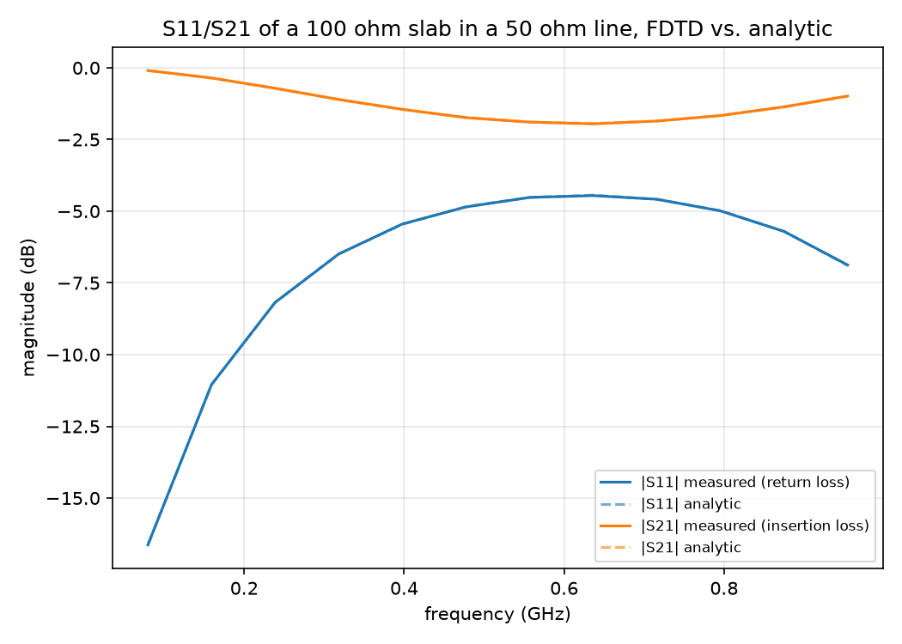
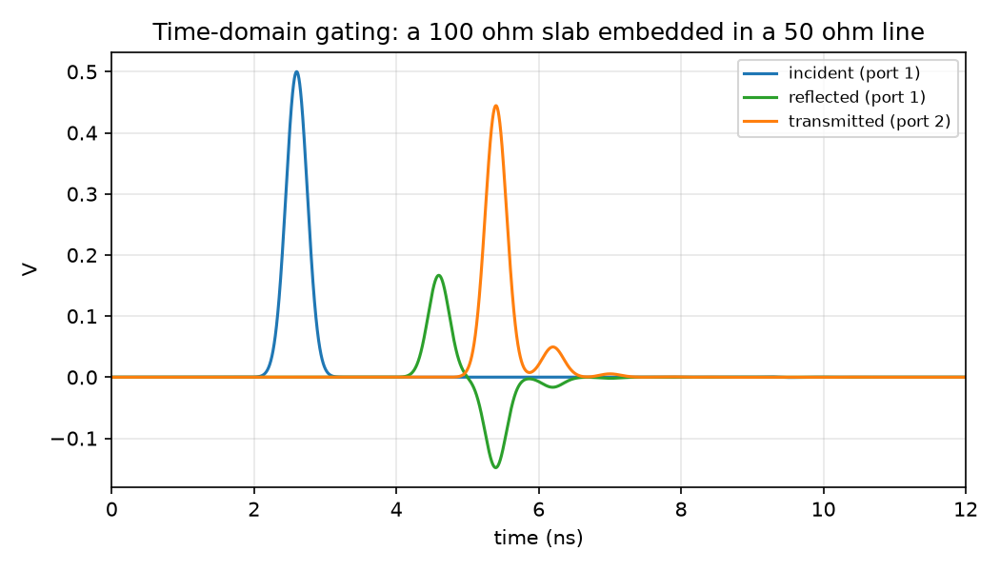

# Stage B: S-Parameters From Fields (a virtual network analyzer)

## Goal

Turn the FDTD line into the instrument a network analyzer (VNA) actually
is: excite one end, record what comes back and what gets through, and
compute S11(f) (return loss) and S21(f) (insertion loss) for an impedance
discontinuity, from the simulated fields, checked against the exact
analytic two-port result.

## The setup

A line of impedance Z1 = 50 ohm, with a short slab of a different
impedance (Zmid) embedded in the middle: Z1 - Zmid - Z1. Both ends of the
whole line are matched to Z1, so the ONLY reflections anywhere come from
the two impedance steps around the slab, the same as a real via or
connector transition. The propagation velocity is kept the same in every
region (only the impedance ratio changes) so a discontinuity's reflection
is purely from the impedance step, not a change in wave speed.

- **Port 1 reference plane**: `obs1`, in the Z1 region before the slab.
- **Port 2 reference plane**: `obs2`, in the Z1 region after the slab.
- **Core**: `src/twoport_fdtd.cpp`, the same Yee leapfrog scheme as Stage
  A's core, generalized to position-dependent L(x)/C(x) arrays.

## Time-domain gating (how a real VNA separates incident/reflected/transmitted)

A VNA doesn't measure "reflected" and "incident" directly; it measures a
total signal and separates the parts by timing (gating) or by a
directional coupler. Here:

1. **Run the same simulation twice**: once with the slab (`Zmid`), once
   with `Zmid = Z1` (no discontinuity at all, a uniform matched line).
2. At **obs1**, the reference run has NO reflection ever (matched
   everywhere), so its waveform there is the pure incident wave. By
   causality, the actual run's waveform at obs1 is bit-identical to the
   reference run's up until the moment a reflection from the slab can
   physically get back to obs1. So `v_reflected = v_actual - v_reference`
   at obs1 isolates the reflected wave exactly, no approximation.
3. At **obs2**, the far end is matched to Z1, so nothing ever reflects
   back into that region. Every volt that ever appears at obs2 in the
   actual run IS the transmitted wave, directly, no subtraction needed.
4. FFT (windowed, see below) each of incident/reflected/transmitted and
   divide: `S11(f) = FFT(reflected)/FFT(incident)`,
   `S21(f) = FFT(transmitted)/FFT(incident)`. This is valid without any
   impedance renormalization because both reference planes sit in Z1.

## Results

Measured (solid) vs. analytic (dashed, via the slab's ABCD matrix) for a
100 ohm slab in a 50 ohm line. The dashed lines are barely visible because
they sit almost exactly under the solid ones: max |S11| error 0.0012, max
|S21| error 0.0016, over the source's usable bandwidth.

The three separated waveforms. The reflected trace clearly shows TWO
lobes: the immediate reflection off the first interface (a plain impedance
step, so it comes back FIRST and looks flat-spectrum), then a second,
comparable-sized lobe arriving after a full round trip inside the slab,
with the interference between them being exactly what makes S11(f) and
S21(f) vary with frequency instead of being flat.

Cross-checked against 3 (Zmid, slab length) combinations in
`tests/test_sparams.py`, all matching the analytic result to better than
2% over the source's usable bandwidth.

## What went wrong

Two real bugs here, both in the measurement/analysis, not the physics
(the FDTD core itself matched the analytic multi-bounce amplitudes to 4
significant figures on the very first working run):

1. **Assuming later bounces would be small.** My first mental model was
   "each round trip inside the slab loses about 90% of its amplitude, so
   only the first bounce matters." That's wrong: the round-trip
   attenuation factor (`Gamma_2 * Gamma_1`, using the reflection
   coefficients AT EACH INTERFACE) is indeed small, but the amplitude
   that actually escapes back out at each round trip also involves the
   TRANSMISSION coefficients (`1 + Gamma`, which can be well above 1
   for a step up in impedance), and those aren't small. Worked out by
   hand for a 50/100 ohm step: the first reflected pulse is
   `Gamma_1 = 0.333`, but the SECOND one (one round trip later) is
   `T_1 * Gamma_2 * T_1' = 1.333 * (-0.333) * 0.667 = -0.296`, comparable
   in size to the first, not 10x smaller. A short first test run (not
   long enough to capture this second pulse) gave S-parameters that were
   flat-out wrong; a long enough run, whose measured second-bounce
   amplitude (-0.148, after the additional distance back to the
   observation point) matched this hand calculation exactly, confirmed
   the simulation itself was right and the test was the problem.
2. **A Hamming window has no flat top.** After fixing the run length and
   cropping the FFT input to the signal's actual active window (so
   nothing gets clipped or padded with a huge amount of dead time), S21
   was STILL 20-50% too high, consistently. The cause: a Hamming window
   is a raised cosine over its ENTIRE length (0.08 at the very edges,
   only 0.54 a quarter of the way in, reaching 1.0 only exactly at the
   center) -- there is no region where it's flat. Since the incident
   pulse, the first reflection, and the second reflection each arrive at
   a different time and therefore sit at a different distance from the
   window's center, each one gets a DIFFERENT attenuation factor, which
   directly corrupts the S11/S21 ratio even with an otherwise-perfect
   crop. Confirmed by computing S21 with a Hamming window vs. a Tukey
   window (flat across the middle ~90% of its length, tapered only at
   the outer edges) on the exact same cropped data: Hamming gave >10% to
   >100% error depending on frequency, Tukey gave <2% error everywhere in
   band. `tests/test_sparams.py::test_windowing_choice_matters` keeps
   this as a regression check.

## Implementation map

| Piece | Code |
|---|---|
| Two-port FDTD core | `src/twoport_fdtd.cpp` |
| Build, run, gate, FFT, analytic ABCD comparison | `py/twoport.py` |
| Figures | `py/run_sparams.py` |
| Tests | `tests/test_sparams.py` |

## References

- ABCD-to-S-parameter conversion and the transmission-line-section ABCD
  matrix: Pozar, *Microwave Engineering* (two-port network conversion
  tables).
- Time-domain gating is standard VNA post-processing practice for
  isolating a discontinuity's response from fixture/cable effects.
