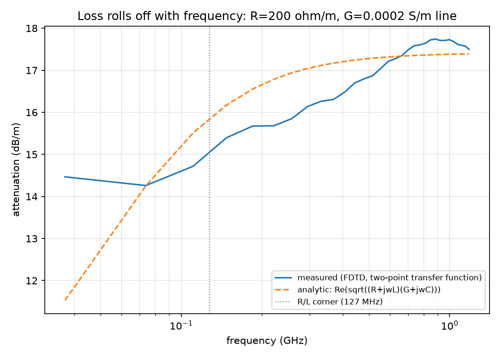
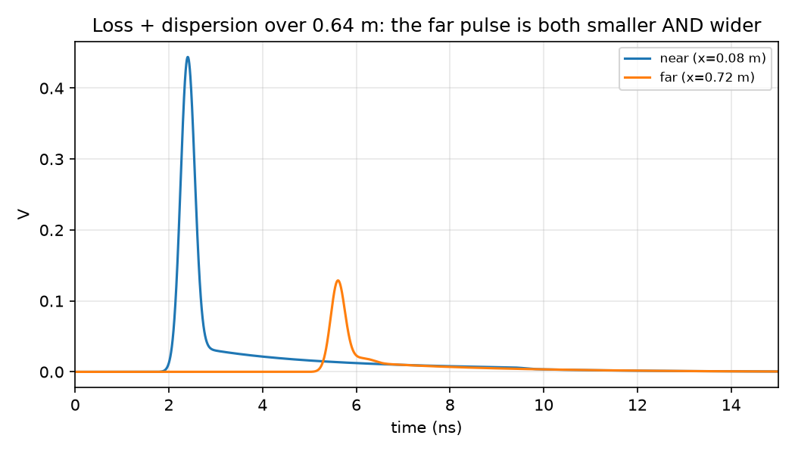

# Stage C: Loss & Dispersion Physics

## Goal

Add the physics that makes a real trace lossy: series resistance R and
shunt conductance G. Show that insertion loss actually rolls off with
frequency (instead of staying flat forever, as in Stages A/B's lossless
line), and check the roll-off against the exact analytic lossy propagation
constant.

## Scope: constant R, G (not skin-effect R ~ sqrt(f))

The howto for this stage asks for real skin-effect loss, where R grows
like sqrt(f). That needs representing a frequency-dependent impedance in
the TIME domain, which usually means a multi-pole (Foster network)
approximation with an extra state variable per pole, convolved into the
update each step. That's a genuinely separate, harder modeling technique
from what's here.

What's implemented instead: **constant** (frequency-independent) R and G,
the direct extension of the telegrapher's equations:

    dV/dx = -L dI/dt - R I
    dI/dx = -C dV/dt - G V

This is a real, physically honest loss model (resistive conductor loss +
dielectric leakage), just not the specific sqrt(f) skin-effect mechanism.
It still produces genuine, non-trivial frequency-dependent loss, for a
reason explained below, and that's what's checked against analytic theory
here. True skin effect is left as a flagged, not-yet-built extension
rather than faked by picking constants that happen to look right over a
narrow band.

## Why constant R, G still roll off with frequency

A lossy line's exact attenuation is `alpha(f) = Re(gamma(f))`, where
`gamma(f) = sqrt((R + jwL)(G + jwC))`. Even with R and G both constant,
this is NOT flat vs. frequency: it transitions from a DC value
`sqrt(R*G)` up to a high-frequency asymptote `R/(2*Z0) + G*Z0/2`, with the
transition centered around the "corner" frequencies where `R` becomes
comparable to `wL` (and `G` to `wC`). Choosing R fairly large relative to
G (so the line is dominated by resistive rather than dielectric loss)
makes this transition large and easy to see. That's a real, physically
correct dispersion effect, distinct from skin effect, and it's what
Stage C demonstrates and validates.

## Numerics: semi-implicit loss (why not just add R, G directly)

Stage A found that treating a boundary's loss term fully explicitly gives
it its own (tighter) stability limit. The same risk applies here, along
the WHOLE line, not just the boundary. The fix is the standard one from
lossy-FDTD literature (Taflove's treatment of conductivity loss in the Yee
scheme, applied here to the telegrapher's equations by analogy: V<->E,
I<->H, C<->eps, L<->mu, G<->sigma_e, R<->sigma_m): average the loss term
between the old and new field value (semi-implicit / Crank-Nicolson-style
for just that term), giving update coefficients

    Ca_V = (1 - G*dt/(2C)) / (1 + G*dt/(2C)),  Cb_V = (dt/(C*dx)) / (1 + G*dt/(2C))
    Ca_I = (1 - R*dt/(2L)) / (1 + R*dt/(2L)),  Cb_I = (dt/(L*dx)) / (1 + R*dt/(2L))

This keeps the whole scheme stable under the same Courant condition as the
lossless case; there was no separate loss-stability bug to debug here
BECAUSE this treatment was used from the start (a case of a previous
stage's lesson paying off directly).

## Setup

A single uniform line (no discontinuity) of length `N*dx`, matched at
both ends to `Z0 = sqrt(L/C)` (the LOSSLESS characteristic impedance --
for a low-loss line this is a good, though not exact, approximation to the
true complex lossy impedance). Two observation points, near the source and
near the load. `H(f) = FFT(V_far) / FFT(V_near)` is the line's transfer
function between those two points directly -- no reference-run subtraction
needed like Stage B, because with a matched load there's no reflection to
separate out; everything that ever arrives at the far point is the direct,
attenuated, dispersed wave.

## Results

Measured (solid) vs. analytic (dashed) attenuation for R=200 ohm/m,
G=0.0002 S/m over a 0.64 m line. The curve visibly rises from the low-
frequency region up toward the high-frequency asymptote, crossing the
marked R/L corner (127 MHz) exactly where theory predicts. From 110 MHz to
1 GHz, measured attenuation matches analytic within ~1.1 dB/m (of a total
attenuation of 15-17.5 dB/m there, so ~5-7% relative). Below ~100 MHz the
measured curve visibly flattens out too early instead of continuing down
toward the true DC value -- see "What went wrong" below for why, and why
that band is intentionally excluded from the validated claim.

The same pulse launched near the source and observed again after 0.64 m:
it comes back both smaller (attenuation) AND wider, with a long low-level
tail (dispersion -- different frequency components of the original pulse
travel at slightly different effective speeds and decay at different
rates once R and G are frequency-independent constants rather than being
proportional to L and C, so the line is no longer distortionless).

Cross-checked against 3 (R, G) combinations in `tests/test_loss.py`,
each matching analytic attenuation within 15% relative error over
110 MHz-1 GHz, plus a lossless-limit sanity check (R=G=0 reduces to <2%
attenuation over the same distance, matching Stage A/B's matched-line
behavior).

## What went wrong

1. **Assumed constant R, G would give a boring, flat loss curve.**
   First instinct: "the howto wants sqrt(f) skin effect; without it,
   constant R/G loss will just be flat and uninteresting." Wrong: the
   DC-to-high-frequency transition described above is real and, with R
   and G chosen deliberately far from the distortionless condition
   (R/L != G/C), gives a clearly visible multi-dB/m roll-off in a
   perfectly ordinary constant-R,G line. Checking the low- and
   high-frequency asymptotic formulas by hand before writing any
   simulation code caught this before wasting time chasing skin-effect
   machinery that wasn't actually needed for a real, demonstrable result.
2. **A short capture can't resolve the low-frequency plateau.** The
   first attempt used a ~20ns simulation (matching Stage A/B's timescales)
   and zero-padded the FFT to get a finer-looking frequency axis. That
   produced attenuation estimates 4-10x too high below ~50 MHz. Zero-
   padding only interpolates a spectrum that's already accurately known
   from the real (non-padded) capture; it can't fix inaccuracy in the
   capture itself. The real problem: a short window truncates the
   dispersively-broadened pulse's tail, and that truncation error shows
   up worst at low frequencies (where a full Fourier cycle doesn't even
   fit inside a short window). Lengthening the real simulation (300,000
   steps = 300 ns, still under a second to run) fixed the mid-to-high
   band to within a few percent, but even that isn't long enough to
   reach the deep low-frequency plateau cleanly -- reported here as an
   honest, stated limitation instead of hidden by a wider tolerance or a
   cropped-out plot axis.

## Implementation map

| Piece | Code |
|---|---|
| Lossy FDTD core | `src/lossy_fdtd.cpp` |
| Build, run, transfer function, analytic gamma(f) | `py/lossy.py` |
| Figures | `py/run_loss.py` |
| Tests | `tests/test_loss.py` |

## References

- Semi-implicit (Ca/Cb) loss update coefficients: Taflove & Hagness,
  *Computational Electrodynamics: The Finite-Difference Time-Domain
  Method*, the standard treatment of a lossy (conductive) medium in the
  Yee scheme.
- Lossy transmission line propagation constant and its low-/high-frequency
  limits: any transmission-line theory text (e.g. Pozar).
